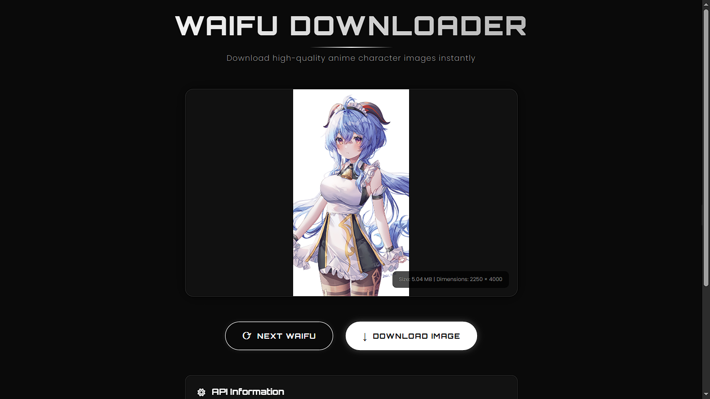

# 🖤 Waifu Downloader

A simple and fast web-based anime image downloader built with HTML, CSS, and JavaScript.

## 📖 About The Project

I created this project because I often used the Waifu Downloader application on Nyarch Linux. However, sometimes the application took a long time to load and had compatibility issues on some systems.

So I decided to create my own lightweight web version that can run directly in any modern browser without installation.

The application fetches random high-quality anime images using the Waifu.im API and allows users to download their favorite images instantly.

---

## 🚀 Live Demo

🌐 Website: https://waifu-downloader.vercel.app/

📂 GitHub Repository: https://github.com/abdussalam090207/waifu-downloader

---

## 📸 Preview



---

## ✨ Features

- 🎲 Random anime image generator
- ⚡ Fast loading experience
- 📥 One-click image download
- 🌙 Modern futuristic dark UI
- 🔄 Next waifu button
- 📱 Responsive design
- 🌐 Browser-based (no installation required)

---

## 🛠️ Built With

- HTML5
- CSS3
- Vanilla JavaScript
- Waifu.im API
- Git & GitHub
- Vercel

---

## ⚙️ Installation

Clone the repository:

```bash
git clone https://github.com/abdussalam090207/waifu-downloader.git
```

Open the project folder:

```bash
cd waifu-downloader
```

Then simply open:

```bash
index.html
```

Or run it with any local web server.

---

## 🔗 API

This project uses the public Waifu.im API to fetch random anime images.

API Endpoint:

```
https://api.waifu.im/images
```

---

## 🎯 Future Improvements

Planned features for future updates:

- 🏷️ Image category & tag filters
- ❤️ Favorite system using Local Storage
- 🖼️ Download history/gallery
- 🎨 More animations and UI improvements
- 🔎 Image search and filtering options

---

## 📜 License

This project is open source and available under the MIT License.

---

Made with ❤️ by Abdus Salam
